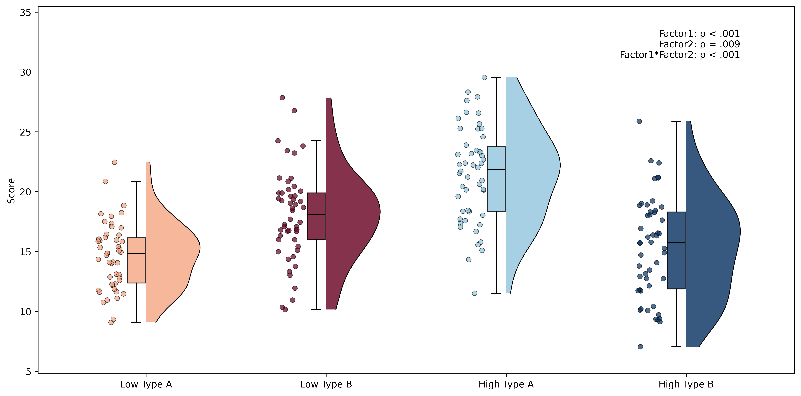

# 📊 Data Visualization Toolkit

**Author:** Quentin Chenot  
**License:** MIT  
**Version:** 1.0  
**Date:** 2025/09/15 [YYYY/MM/DD]  

This repository provides **flexible plotting functions** designed for transparent and reproducible research workflows:

- **Correlation plots** (`plot_correlation`)  
- **Likert plots** (`plot_likert`)  
- **Raincloud plots** (`plot_raincloud`)  

All functions are implemented in **Python**, rely on standard scientific libraries, and include example datasets + usage scripts to support reproducibility.  

---

## ✨ Features

- 📈 **Correlation plots** with regression lines, marginal densities, and annotated *r, r², p-values*  
- 🌧 **Raincloud plots** (half-violin + boxplot + jitter) with optional ANOVA results 
- 📝 **Likert plots** for visualizing questionnaire data on diverging scales  
- 💾 Export figures (PDF, PNG, etc.)
---

## 📦 Installation

Clone the repository:

```bash
git clone https://github.com/Chenot/DataVisualization.git
cd DataVisualization
```

Install required dependencies:

```bash
pip install -r requirements.txt
```

Minimal requirements:
- `matplotlib`
- `seaborn`
- `pandas`
- `numpy`
- `scipy`
- `statsmodels`

---

## 🚀 Usage

Each script is standalone and can be used independently. Example:

```python
# Hypothesis 1 (Fig. 1). As the horse power increase, the miles per gallon will decrease
from correlation_plot import plot_correlation
import seaborn as sns
import os

base_dir = os.path.dirname(os.path.dirname(os.path.abspath(__file__)))
df = sns.load_dataset("mpg").dropna(subset=["horsepower", "mpg"])
plot_correlation(df, x="horsepower", y="mpg",
                 x_label="Horsepower", y_label="Miles per Gallon",
                 save_path=os.path.join(base_dir, "figures", "correlation_plot.pdf"))
```

More examples are included in each script’s `__main__` block.

---

## 📊 Example Outputs

### Correlation Plot


### Raincloud Plot (One-Way)


### Raincloud Plot (Two-Way)


### Likert Plot


---

## 📜 License

This project is licensed under the **MIT License**.  
You are free to use, modify, and distribute this software with attribution.  
